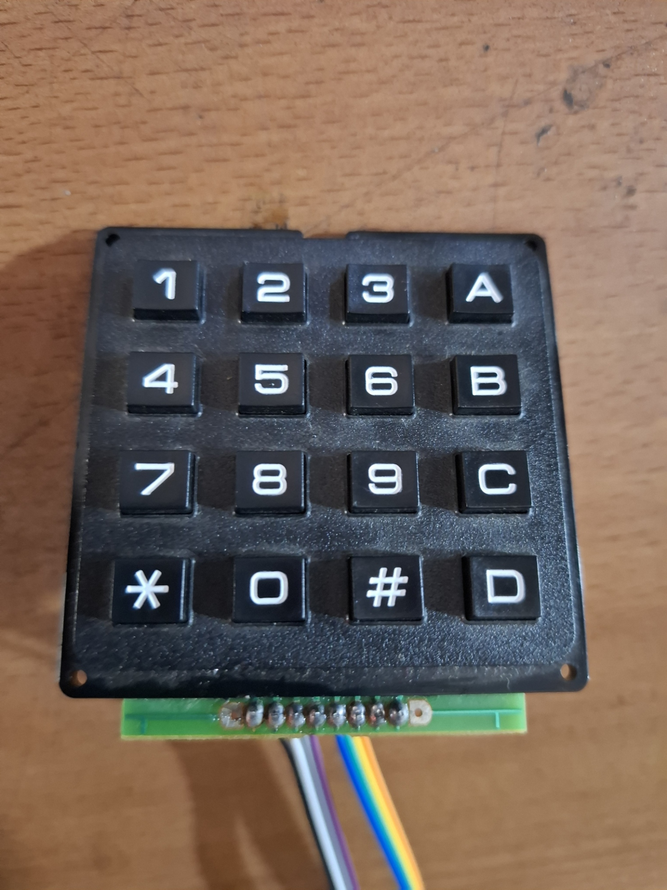
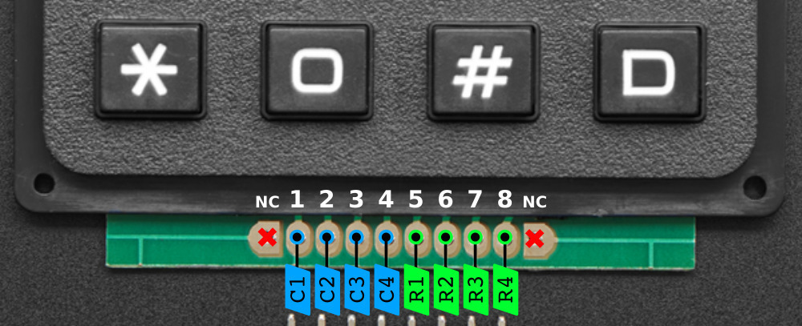
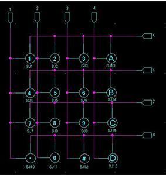

# Interfacing a 4x4 Keypad with Raspberry Pi (Python Code)

## Overview

| 4x4 Keypad |
|------------|
|  |

A 4x4 keypad is a matrix of 16 buttons arranged in a grid with 4 rows and 4 columns. Each button connects a specific row to a column. When a button is pressed, it completes a circuit between a row and a column, allowing us to detect which key was pressed.

## Wiring

1. **Keypad Pins**

   - The first 4 pins correspond to the columns (C1 to C4).
   - The next 4 pins correspond to the rows (R1 to R4).

    | Keypad Pinout |
    |---------------|
    | |

    | Keypad Arrangement |
    |--------------------|
    |  |

2. **Raspberry Pi GPIO Pins**

   Connect the keypad to any GPIO pins on the Raspberry Pi. For this example, we’ll use the following configuration:

    | **Keypad Pins** | **Raspberry Pi GPIO Pins** | **Raspberry Pi Pin Numbers** |
    |-----------------|----------------------------|-------------------------------|
    | Column 1 | GPIO4 | 7 |
    | Column 2 | GPIO17 | 11 |
    | Column 3 | GPIO27 | 13 |
    | Column 4 | GPIO22 | 15 |
    | Row 1 | GPIO18 | 12 |
    | Row 2 | GPIO23 | 16 |
    | Row 3 | GPIO24 | 18 |
    | Row 4 | GPIO25 | 22 |

    | Raspberry Pi GPIO Pinout |
    |--------------------------|
    |  |
    |  |

## Python Code

1. Pin Configuration

    - Set the **columns** as **outputs** with an initial **LOW** value
    - Configure the **rows** as **inputs** with **internal pull-down resistors** to prevent floating

2. Scanning Process

    - Activate **one column at a time** by setting it to a **HIGH** level (3.3V)
    - Check the input on each row. If a **row** reads **HIGH**, a button is **pressed**
    - Record the corresponding key value and deactivate the row output

3. Debouncing

    - Add a small delay (debounce time) after detecting a key press to prevent repeated readings due to mechanical bouncing of the button contacts.

Python script to read the keypad input:

```python
import RPi.GPIO as GPIO
from time import sleep

class Keypad:
    def __init__(self):
        # GPIO pin configuration
        self.ROWS = [18, 23, 24, 25]    # GPIO pins for rows
        self.COLS = [4, 17, 27, 22]      # GPIO pins for columns

        # Keypad configuration (4x4)
        self.KEYPAD = [
            [1, 2, 3, 'A'],
            [4, 5, 6, 'B'],
            [7, 8, 9, 'C'],
            ['*', 0, '#', 'D']
        ]

        # Setup GPIO
        self.setup()

    def setup(self):
        GPIO.setwarnings(False)
        GPIO.setmode(GPIO.BCM)

        # Set column as outputs and set them to LOW
        for col in self.COLS:
            GPIO.setup(col, GPIO.OUT, initial=GPIO.LOW)

        # Set up row as inputs with pull-down resistors to avoid floating
        for row in self.ROWS:
            GPIO.setup(row, GPIO.IN, pull_up_down=GPIO.PUD_DOWN)

    def read_keypad(self):
        for col_idx, col in enumerate(self.COLS):
            GPIO.output(col, GPIO.HIGH)  # set output to HIGH, one at a time
            for row_idx, row in enumerate(self.ROWS):
                if GPIO.input(row) == GPIO.HIGH:  # Check if the key is pressed
                    sleep(0.2) #Debounce time
                    key = self.KEYPAD[row_idx][col_idx]
                    while GPIO.input(row) == GPIO.HIGH:
                        pass
                    GPIO.output(col, GPIO.LOW)  # Deactivate output after the key pressed
                    return key
            GPIO.output(col, GPIO.LOW)  # Deactivate the output after scan the input
        return None

    def print_keypad(self):
        key = self.read_keypad()
        if key:
            print(f"Key Pressed: {key}")

    def cleanup(self):
        GPIO.cleanup()  # Clean up GPIO

if __name__ == "__main__":
    # Initialize the Keypad
    keypad = Keypad()

    try:
        while True:
            keypad.print_keypad()
    except KeyboardInterrupt:
        keypad.cleanup()  # Clean up GPIO on CTRL+C exit
        print("\nApplication stopped!")

```

## Source

1. Matrix Keypad Pinouts : [Keypad Pinouts](https://learn.adafruit.com/matrix-keypad/pinouts)
2. Raspberry Pi GPIO Pinout : [Raspberry Pi GPIO](https://www.raspberrypi.com/documentation/computers/raspberry-pi.html#gpio-and-the-40-pin-header)
